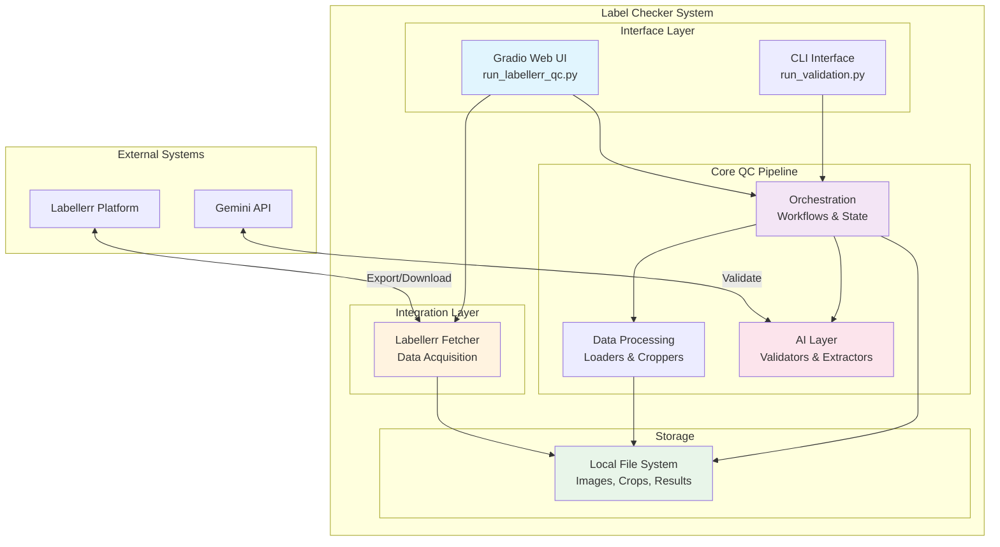
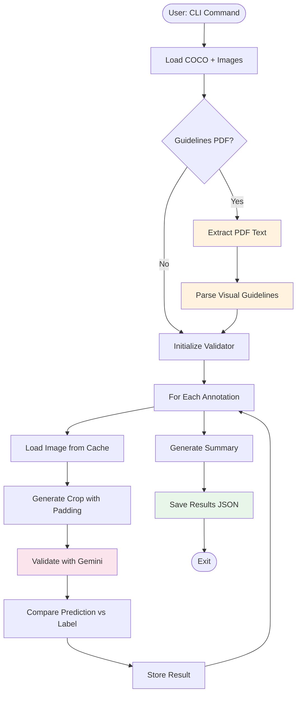
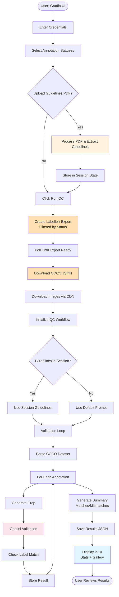
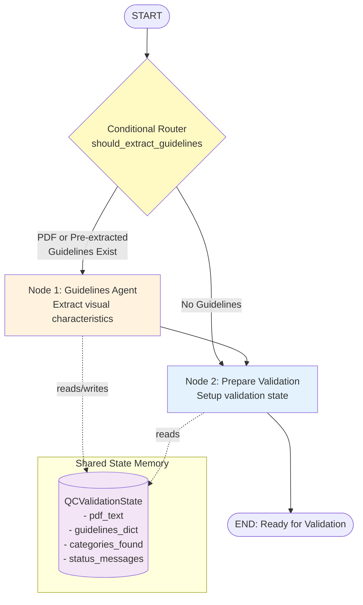
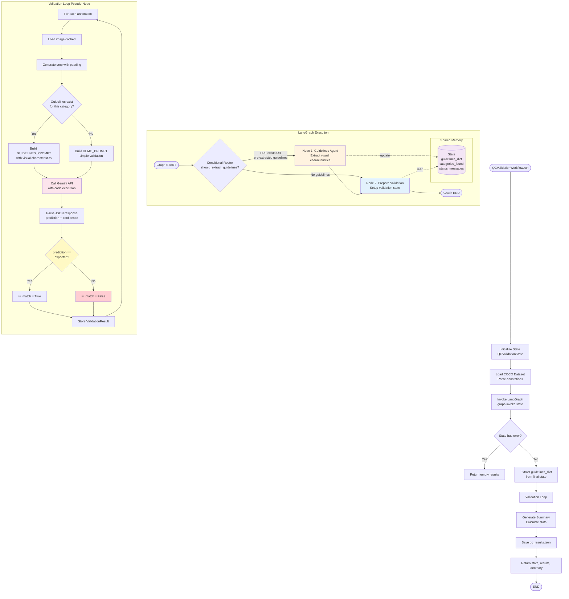
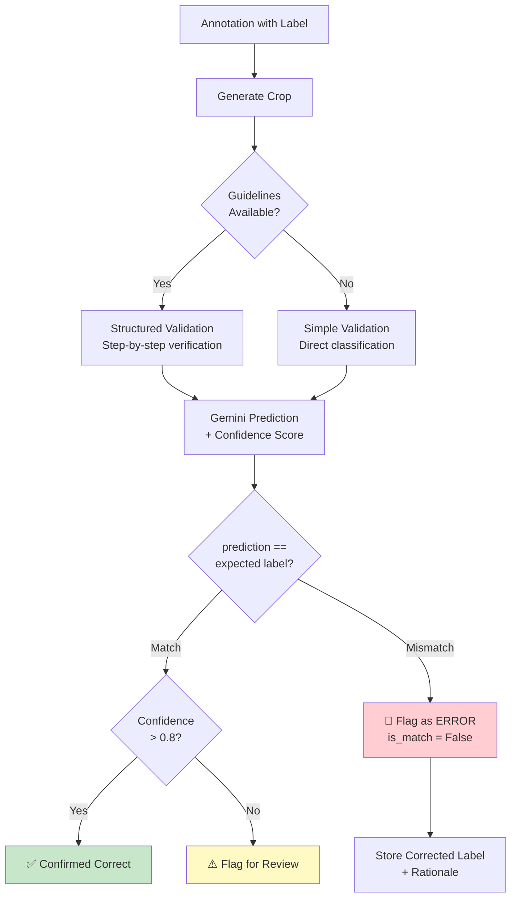

# System Architecture

Complete architectural overview of the AI-powered annotation validation system.

---

## 🤖 Quick Overview: Agent System

**Multi-Agent Architecture**: 3-node LangGraph workflow with shared memory

| Component | Purpose | Key Feature |
|-----------|---------|-------------|
| **Node 1: Guidelines Agent** | Extract visual characteristics from PDFs | Structured context for validation |
| **Node 2: Prepare Validation** | Setup validation state | Readiness logging |
| **Validation Loop** (Pseudo-node) | Process each annotation | Code execution for counting |
| **Shared State Memory** | Persist guidelines across runs | Session caching |

**How Predictions Work**:
1. **Context Gathering**: Extract visual characteristics from guideline PDF
2. **Systematic Validation**: Multi-step verification with code execution
3. **Self-Correction**: Detects wrong labels by comparing prediction vs expected
4. **Confidence Scoring**: Conservative assessment (only high confidence when certain)

**Self-Correction Mechanism** ✨:
- **Quantifiable Features**: Gemini executes Python code to count (e.g., wheels)
- **Characteristic Verification**: Checks each visual feature YES/NO
- **Mismatch Detection**: `is_match = False` when prediction ≠ expected label
- **Flagging System**: Separates high-confidence errors from uncertain cases

**Memory System**:
- Guidelines extracted once, reused across validations
- State threaded through LangGraph nodes
- Gradio session caching for UI persistence

Jump to: [LangGraph Diagram](#3-orchestration-layer-langgraph-agent-system) | [Self-Correction Details](#-self-correction--error-detection)

---

## 🏗️ High-Level Architecture



---

## 📦 Module Structure

### Directory Tree
```
label-checker/
├── qc_pipeline/                    # Core validation engine
│   ├── __init__.py
│   ├── data_loader.py             # COCO parser
│   ├── image_utils.py             # Crop generation
│   ├── pdf_utils.py               # PDF text extraction
│   ├── guidelines_extractor.py    # Structured guideline parsing
│   ├── gemini_validator.py        # AI validation engine
│   ├── langgraph_validator.py     # State management
│   ├── qc_workflow.py             # Workflow orchestrator
│   ├── run_validation.py          # CLI interface
│   └── README.md                  # Module documentation
│
├── demo/
│   ├── labellerr-integration/     # Platform integration
│   │   ├── labellerr_fetcher.py  # SDK wrapper
│   │   ├── run_labellerr_qc.py   # Gradio UI
│   │   ├── QUICKSTART.md
│   │   └── README.md              # Integration docs
│   │
│   └── run_demo.py                # Standalone demo
│
├── tests/                          # Unit tests
│   ├── test_gemini_validator.py
│   └── test_image_utils.py
│
├── README.md                       # Main documentation
├── ARCHITECTURE.md                 # This file
└── requirements.txt
```

---

## 🔄 System Workflows

### Workflow 1: Standalone Validation (CLI)



### Workflow 2: Labellerr Integration (Gradio UI)



---

## 🧩 Component Deep Dive

### 1. Data Processing Layer

#### data_loader.py
```python
# Input: COCO JSON file
# Output: Structured Python objects

CocoDataset
├── categories: Dict[int, Category]
├── images: Dict[int, ImageInfo]
└── annotations: List[Annotation]

# Usage
dataset = load_coco_dataset("annotations.json")
for image, annotation, category in dataset.iter_annotations():
    # Process each annotation
```

#### image_utils.py
```python
# Input: PIL Image + Annotation
# Output: Cropped image (with optional masking)

CropConfig
├── padding: int (pixels around bbox)
├── mask_polygon: bool (isolate object shape)
└── background_color: RGBA tuple

# Usage
crop = crop_annotation(image, annotation, config)
crop_bytes = image_to_png_bytes(crop)
```

---

### 2. AI Validation Layer

#### gemini_validator.py
```python
# Input: Crop bytes + Expected label + Guidelines
# Output: Structured validation response

GeminiValidator
├── api_key: str
├── model_name: str
├── temperature: float
├── prompt_template: str
└── enable_code_execution: bool

GeminiResponse
├── prediction_label: str
├── confidence: float (0-1)
├── rationale: str
└── raw_text: str

# Three prompt templates available:
# 1. DEMO_PROMPT_TEMPLATE - Simple validation
# 2. DEFAULT_PROMPT_TEMPLATE - Structured validation
# 3. GUIDELINES_PROMPT_TEMPLATE - Context-aware with visual features
```

#### guidelines_extractor.py
```python
# Input: PDF text
# Output: Structured label definitions

LabelDefinition
├── label_name: str
├── definition: str
├── key_characteristics: List[str]  # Visual features
├── examples: Optional[List[str]]
└── common_mistakes: Optional[str]

# Uses LangChain + Pydantic for structured extraction
```

---

### 3. Orchestration Layer (LangGraph Agent System)

#### 🤖 Agent Architecture Overview

The system uses a **stateful multi-agent architecture** powered by LangGraph, consisting of **3 nodes** with shared memory:



#### 🧠 How the Agent Predicts: The Validation Logic

The system makes predictions through a sophisticated multi-stage process:

**Stage 1: Context Gathering (Guidelines Agent)**
```python
# Node 1: Guidelines Agent extracts structured knowledge
Input: PDF with annotation guidelines
Process:
  1. Extract text from PDF using PyPDF
  2. Send to Gemini with structured prompt
  3. Parse visual characteristics for each label category
  
Output: Structured guidelines stored in shared state
  {
    "dog": {
      "definition": "Four-legged canine animal",
      "key_characteristics": [
        "Has 4 legs",
        "Pointed ears",
        "Visible tail",
        "Fur texture"
      ]
    }
  }
```

**Stage 2: Visual Validation (Validation Loop)**
```python
# For each crop, the validator:
For each annotation:
  1. Generate crop with padding around bounding box
  2. Check if guidelines exist for this label category
  3. Build context-aware prompt:
     - If guidelines exist: Use GUIDELINES_PROMPT_TEMPLATE
       → Includes definition + visual characteristics
       → Enables systematic verification steps
     - If no guidelines: Use DEMO_PROMPT_TEMPLATE
       → Simple "is this a [label]?" validation
  
  4. Send crop + prompt to Gemini with code execution enabled
     → Gemini can run Python code to count features (e.g., wheels)
     → Systematically verifies each characteristic
     → Provides step-by-step rationale
  
  5. Parse structured JSON response:
     {
       "prediction_label": "dog",
       "confidence": 0.92,
       "rationale": "Step-by-step analysis..."
     }
  
  6. Compare prediction vs expected label
     → is_match = (prediction.lower() == expected.lower())
```

**Stage 3: Self-Correction Mechanism** ✨
```python
# The system has built-in self-correction through:

1. Strict Validation Prompts:
   - Multi-step verification process
   - Conservative confidence scoring
   - Explicit cross-checking for similar categories
   
2. Code Execution Capability:
   - Gemini can write Python to count objects
   - Example: "four wheeler" → code counts wheels → verifies count == 4
   
3. Characteristic-by-Characteristic Verification:
   STEP 1: Observe entire image
   STEP 2: Count quantifiable features
   STEP 3: Verify EACH characteristic (YES/NO for each)
   STEP 4: Cross-check for confusion with similar classes
   STEP 5: Final verification and honest uncertainty assessment
   
4. Confidence-Based Flagging:
   - Low confidence (<0.5) → Flagged for human review
   - Mismatches → Automatically highlighted in results
   - Rationale provides explanation for corrections
```

#### 📊 Node Details

**Node 1: Guidelines Agent** (`guidelines_agent_node`)
- **Purpose**: Extract and structure annotation guidelines
- **Input**: PDF path or pre-extracted guidelines dict
- **Processing**:
  1. Checks if guidelines already in state (session caching)
  2. If PDF provided: extracts text → sends to Gemini
  3. Parses response into structured format
  4. Stores in shared state memory
- **Output**: Updates state with `guidelines_dict` and `categories_found`

**Node 2: Prepare Validation** (`prepare_validation_node`)
- **Purpose**: Final preparation before validation loop
- **Input**: State with guidelines (if any)
- **Processing**: Logs readiness status and category count
- **Output**: Status message indicating validation readiness

**Conditional Router**: `should_extract_guidelines`
- Decides workflow path based on available context
- Routes to Guidelines Agent if PDF or pre-extracted guidelines exist
- Skips to Prepare Validation if no guidelines provided

#### 💾 Memory System (Shared State)

```python
QCValidationState (TypedDict)
├── pdf_path: Optional[str]           # Input: Path to guidelines PDF
├── pdf_text: Optional[str]           # Extracted: Raw PDF text
├── guidelines_dict: Dict[str, Dict]  # Memory: Structured guidelines
│   └── {
│         "category_name": {
│           "definition": str,
│           "key_characteristics": List[str],
│           "examples": Optional[List[str]],
│           "common_mistakes": Optional[str]
│         }
│       }
├── categories_found: List[str]       # Memory: Available categories
├── pdf_processed: bool               # Status: Whether extraction succeeded
├── gemini_api_key: str               # Config: API credentials
├── output_dir: str                   # Config: Output location
├── status_messages: List[str]        # Memory: Progress messages
└── error: Optional[str]              # Status: Error tracking

# Memory Persistence:
# - State is maintained throughout workflow execution
# - Guidelines are cached in Gradio session_state (UI mode)
# - Subsequent validations reuse extracted guidelines
# - No need to re-process PDF for multiple runs
```

**Key Memory Features**:
1. **State Threading**: Each agent node receives state, modifies it, passes to next node
2. **Conditional Caching**: Pre-extracted guidelines skip PDF processing
3. **Session Persistence**: Gradio UI caches guidelines across validation runs
4. **Error Resilience**: Error messages stored in state without crashing workflow

#### 🔄 Complete Workflow: LangGraph + Validation Loop



#### 📋 Workflow Execution Phases

**Phase 1: Initialization**
```python
# Step 1: Load dataset
dataset = load_coco_dataset(coco_json_path)
annotations = dataset.annotations[:max_files]

# Step 2: Create initial state
initial_state = {
    "pdf_path": pdf_path,
    "guidelines_dict": pre_extracted_guidelines or {},
    "gemini_api_key": api_key,
    "output_dir": str(output_dir),
    # ... other fields
}
```

**Phase 2: LangGraph Execution** (3 Nodes)
```python
# Invoke the compiled graph
final_state = self.graph.invoke(initial_state)

# Graph internally executes:
# 1. Conditional router decides path
# 2. Guidelines Agent (if needed) extracts context
# 3. Prepare Validation logs readiness
# 4. Returns enriched state with guidelines_dict
```

**Phase 3: Validation Loop** (Pseudo-Node)
```python
# Not a LangGraph node - executed in Python
for annotation in annotations:
    # 1. Load image (with caching)
    image = image_cache.get(annotation.image_id)
    
    # 2. Generate crop
    crop = crop_annotation(image, annotation, config)
    
    # 3. Check for guidelines
    category_lower = category.name.lower()
    has_guidelines = category_lower in guidelines_dict
    
    # 4. Validate with context
    if has_guidelines:
        # Use structured prompt with visual characteristics
        label_def = guidelines_dict[category_lower]
        prompt = build_guidelines_prompt(category.name, label_def)
    else:
        # Use simple prompt
        prompt = demo_prompt_template.format(expected_label=category.name)
    
    # 5. Call Gemini
    response = validator.validate_crop(
        crop_bytes=crop_bytes,
        expected_label=category.name,
        label_definitions=guidelines_dict
    )
    
    # 6. Compare and store
    is_match = (response.prediction_label.lower() == category.name.lower())
    results.append(ValidationResult(..., is_match=is_match))
```

**Phase 4: Summary Generation**
```python
# Calculate statistics
matches = sum(1 for r in results if r.is_match is True)
mismatches = sum(1 for r in results if r.is_match is False)
avg_confidence = sum(r.confidence for r in results) / len(results)

# Flag problematic annotations
low_confidence = [r for r in results if r.confidence < threshold]
mismatched = [r for r in results if r.is_match is False]

summary = ValidationSummary(
    matches=matches,
    mismatches=mismatches,
    low_confidence_annotations=low_confidence,
    mismatched_annotations=mismatched
)
```

#### 🎯 Why Validation Loop is Not a Node

The validation loop is **intentionally kept outside LangGraph** for practical reasons:

1. **Performance**: Sequential processing without graph overhead
2. **Simplicity**: Direct Python loop with image caching
3. **State Management**: Avoids complex graph state for thousands of annotations
4. **Flexibility**: Easy to add parallel processing in future

The LangGraph portion handles the **stateful, conditional guideline extraction**, while validation is a **deterministic loop** that consumes the extracted guidelines.

#### qc_workflow.py Data Structures
```python
ValidationResult
├── image_id: int
├── annotation_id: int
├── label: str (expected)
├── prediction_label: str (from AI)
├── is_match: bool               # ← Self-correction indicator
├── confidence: float             # ← Quality metric
├── gemini_response: str          # ← Rationale for decision
└── error: Optional[str]

ValidationSummary
├── total_annotations: int
├── matches: int                  # ← Correct predictions
├── mismatches: int               # ← Detected errors
├── average_confidence: float
├── confidence_by_category: Dict
├── low_confidence_annotations: List  # ← Flagged for review
└── mismatched_annotations: List      # ← Self-corrected labels
```

---

### 4. Integration Layer

#### labellerr_fetcher.py
```python
# Input: Labellerr credentials + status filters
# Output: COCO JSON + Downloaded images

LabellerrFetcher
├── create_and_download_export()
│   ├── Creates export with status filter
│   ├── Polls until ready
│   └── Returns COCO JSON path
│
└── download_project_images()
    ├── Extracts image references
    ├── Gets signed CDN URLs
    └── Downloads all images

# Status filters available:
# - review, r_assigned
# - client_review, cr_assigned
# - accepted
```

---

## ✨ Self-Correction & Error Detection

### How the System "Gets it Right" When Labels Are Wrong

The system has a sophisticated **self-correction mechanism** that can detect when human annotators have applied the wrong label:

#### 🔍 Detection Strategy



#### 🧠 Multi-Layer Correction Mechanism

**Layer 1: Systematic Visual Verification**
```python
# The GUIDELINES_PROMPT_TEMPLATE enforces a strict protocol:

STEP 1 - OBSERVE THE IMAGE:
✓ Look at entire image systematically
✓ Identify all visible objects and features

STEP 2 - COUNT QUANTIFIABLE FEATURES:
✓ If label implies count (e.g., "four wheeler"), COUNT them
✓ Gemini can execute Python code to count:
  
  # Example code execution by Gemini:
  count_wheels = count_visible_wheels(image)
  if count_wheels == 2 and expected_label == "four wheeler":
      # MISMATCH DETECTED
      return {"prediction_label": "two wheeler", "confidence": 0.95}

STEP 3 - VERIFY EACH CHARACTERISTIC:
✓ Go through each visual characteristic one-by-one
✓ Mark YES/NO for each feature
✓ Accumulate mismatches

STEP 4 - CROSS-CHECK FOR CONFUSION:
✓ Could this be confused with similar category?
✓ What distinguishes it from similar objects?
✓ Are there contradictory visual cues?

STEP 5 - FINAL VERIFICATION:
✓ Review analysis again
✓ Double-check counts and observations
✓ Be honest about uncertainty
```

**Layer 2: Code Execution for Precise Analysis**
```python
# Gemini can write and execute Python code for:

1. Counting objects:
   wheels_count = len(detect_circular_objects(image))
   
2. Measuring features:
   aspect_ratio = width / height
   if aspect_ratio > 2.0:
       prediction = "wide_object"
       
3. Analyzing patterns:
   has_stripes = detect_stripe_pattern(image)
   if has_stripes and expected_label == "solid_color":
       # MISMATCH DETECTED
       confidence = 0.9
```

**Layer 3: Confidence-Based Flagging**
```python
# Results are categorized by confidence:

if confidence >= 0.8 and is_match:
    status = "✅ HIGH CONFIDENCE - Correct label"
    
elif confidence >= 0.8 and not is_match:
    status = "🚨 HIGH CONFIDENCE - WRONG LABEL DETECTED"
    # System is confident the human got it wrong
    
elif confidence < 0.5:
    status = "⚠️ LOW CONFIDENCE - Needs human review"
    # System is uncertain, flag for expert review
```

#### 📊 Self-Correction Examples

**Example 1: Quantifiable Feature Mismatch**
```python
# Input annotation
{
    "category": "four wheeler",
    "image": "vehicle_crop.png"
}

# Gemini analysis with code execution
'''
Step 1: Observed vehicle in image
Step 2: Counted wheels using circular detection
  → Found 2 wheels visible
  → Expected 4 for "four wheeler"
Step 3: Verified other characteristics
  → Has handlebars (typical of two wheeler)
  → Single seat configuration
Step 4: Cross-check
  → Visual characteristics match "two wheeler"
  → No evidence of 4 wheels
'''

# Response
{
    "prediction_label": "two wheeler",
    "confidence": 0.92,
    "rationale": "Image shows vehicle with only 2 wheels and handlebars...",
    "is_match": False  # ← ERROR DETECTED
}

# System action
→ Adds to mismatched_annotations list
→ Flags for human review with corrected label
→ Provides detailed rationale for correction
```

**Example 2: Visual Characteristic Mismatch**
```python
# Input annotation
{
    "category": "dog",
    "image": "animal_crop.png"
}

# Gemini systematic verification
'''
Step 1: Observed animal in image
Step 2: No counting needed (not quantifiable)
Step 3: Verified each characteristic from guidelines:
  [✗] Has 4 legs → YES (matches)
  [✗] Pointed ears → NO (has round ears)
  [✗] Tail → YES (matches)
  [✗] Snout shape → NO (flat face, not elongated)
  [✗] Overall body shape → NO (stockier than typical dog)
Step 4: Cross-check
  → Could be confused with "cat"
  → Visual characteristics align more with feline features
'''

# Response
{
    "prediction_label": "cat",
    "confidence": 0.87,
    "rationale": "Animal has round ears and flat face typical of cats...",
    "is_match": False  # ← ERROR DETECTED
}
```

**Example 3: High Confidence Validation (Correct Label)**
```python
# Input annotation
{
    "category": "dog",
    "image": "golden_retriever.png"
}

# Gemini verification
'''
Step 1: Observed dog in image
Step 2: No counting needed
Step 3: Verified characteristics:
  [✓] Has 4 legs → YES
  [✓] Pointed ears → YES
  [✓] Visible tail → YES
  [✓] Elongated snout → YES
  [✓] Fur texture → YES (golden color, typical dog coat)
Step 4: No confusion with other categories
  → Clear canine features
'''

# Response
{
    "prediction_label": "dog",
    "confidence": 0.95,
    "rationale": "Image clearly shows a dog with all expected characteristics...",
    "is_match": True  # ← CONFIRMED CORRECT
}
```

#### 🎯 Output: Actionable Corrections

The system generates structured output for human reviewers:

```json
{
  "summary": {
    "matches": 42,
    "mismatches": 8,  // ← Labels system believes are wrong
    "accuracy": 84.0
  },
  "mismatched_annotations": [
    {
      "annotation_id": 1234,
      "label": "four wheeler",           // ← Human's label
      "prediction_label": "two wheeler", // ← System's correction
      "confidence": 0.92,
      "rationale": "Counted only 2 wheels visible, has handlebars...",
      "crop_path": "output/crops/crop_1234_four_wheeler.png"
    }
  ],
  "low_confidence_annotations": [
    {
      "annotation_id": 5678,
      "label": "dog",
      "confidence": 0.45,
      "rationale": "Image is blurry, cannot verify all characteristics...",
      "crop_path": "output/crops/crop_5678_dog.png"
    }
  ]
}
```

#### 💡 Key Benefits

1. **Catches Mislabeling**: Detects when human annotators applied wrong labels
2. **Provides Evidence**: Includes detailed rationale for corrections
3. **Prioritizes Review**: Separates high-confidence corrections from uncertain cases
4. **Maintains Accuracy**: Conservative confidence scoring prevents false corrections

This self-correction capability makes the system valuable not just for **validation** but also for **quality improvement** of annotation datasets.

---

## 🔀 Data Flow Analysis

### Input Data Flow
```
User Input
    ↓
┌─────────────────────────────────┐
│ Labellerr Platform              │
│ - Annotations with statuses     │
│ - Images in CDN                 │
│ - Guidelines PDF (optional)     │
└─────────────────────────────────┘
    ↓
┌─────────────────────────────────┐
│ Acquisition Layer               │
│ - SDK creates filtered export   │
│ - Downloads COCO JSON           │
│ - Fetches images from CDN       │
└─────────────────────────────────┘
    ↓
┌─────────────────────────────────┐
│ Local Storage                   │
│ - annotations.json              │
│ - images/                       │
└─────────────────────────────────┘
    ↓
┌─────────────────────────────────┐
│ Data Processing                 │
│ - Parse COCO format             │
│ - Load images                   │
│ - Generate crops                │
└─────────────────────────────────┘
    ↓
┌─────────────────────────────────┐
│ AI Validation                   │
│ - Build context prompts         │
│ - Call Gemini API               │
│ - Parse responses               │
└─────────────────────────────────┘
    ↓
┌─────────────────────────────────┐
│ Result Processing               │
│ - Compare predictions vs labels │
│ - Calculate confidence          │
│ - Flag mismatches               │
└─────────────────────────────────┘
    ↓
Output (JSON + UI)
```

### State Management Flow
```
Session Start
    ↓
┌──────────────────────────────┐
│ Gradio State Initialized     │
│ guidelines_state = {}        │
└──────────────────────────────┘
    ↓
User Uploads PDF (Optional)
    ↓
┌──────────────────────────────┐
│ Guidelines Agent Triggered   │
│ - Extract PDF text           │
│ - Parse with Gemini          │
│ - Store in State             │
└──────────────────────────────┘
    ↓
User Clicks "Run QC"
    ↓
┌──────────────────────────────┐
│ Validation Agent             │
│ - Retrieve guidelines from   │
│   Gradio State               │
│ - Use in validation prompts  │
└──────────────────────────────┘
    ↓
Guidelines Persist Across
Multiple Validation Runs
```

---

## 🎯 Key Design Decisions

### 1. **Modularity**
- **Decision**: Separate QC pipeline from integrations
- **Rationale**: Allows standalone use and easy integration with other platforms
- **Benefit**: Reusable components, testable in isolation

### 2. **Stateful Workflow**
- **Decision**: Use LangGraph for state management
- **Rationale**: Guidelines extraction is expensive, should be done once
- **Benefit**: Session persistence, reduced API calls

### 3. **Mismatch Detection**
- **Decision**: Separate confidence from match/mismatch
- **Rationale**: High confidence in wrong label is still a problem
- **Benefit**: Catches intentionally mislabeled test cases

### 4. **Two-Agent Architecture**
- **Decision**: Separate agents for guidelines vs validation
- **Rationale**: Different concerns, different triggers
- **Benefit**: Clear separation, optional guidelines

### 5. **Image Caching**
- **Decision**: Cache loaded images during batch processing
- **Rationale**: Multiple annotations may reference same image
- **Benefit**: Significant performance improvement

### 6. **Crop Masking**
- **Decision**: Support polygon masking with transparency
- **Rationale**: Reduces visual noise for AI
- **Benefit**: More accurate validation on irregular shapes

---

## 🔌 Integration Points

### External APIs
1. **Gemini API**
   - Endpoint: `https://generativelanguage.googleapis.com/v1beta`
   - Models: `gemini-2.0-flash-exp`, `gemini-3-flash-preview`
   - Rate Limits: Based on API tier
   - Authentication: API key in header

2. **Labellerr API**
   - Base URL: `https://api.labellerr.com`
   - Authentication: API key + secret + client ID
   - Key Endpoints:
     - POST `/export` - Create export
     - GET `/export/status` - Poll status
     - GET `/cdn-web/files_links` - Get signed URLs

### Data Formats
1. **COCO JSON**
   ```json
   {
     "images": [{"id", "file_name", "width", "height"}],
     "annotations": [{"id", "image_id", "category_id", "bbox", "segmentation"}],
     "categories": [{"id", "name", "supercategory"}]
   }
   ```

2. **Validation Results**
   ```json
   {
     "results": [ValidationResult],
     "summary": ValidationSummary,
     "workflow_state": {
       "pdf_processed": bool,
       "categories_found": [str],
       "guidelines_used": bool
     }
   }
   ```

---

## 🚀 Performance Characteristics

### Scalability
- **Annotations**: Handles 1000+ annotations per run
- **Images**: Caches images to reduce memory churn
- **Batch Size**: Configurable via `max_files` parameter

### Bottlenecks
1. **Gemini API**: Sequential validation (rate limited)
2. **Image Download**: Network dependent
3. **PDF Extraction**: One-time cost per session

### Optimization Strategies
1. Image caching (implemented)
2. Parallel Gemini calls (future)
3. Result caching for repeated validations (future)
4. Incremental validation (future)

---

## 🔒 Error Handling

### Retry Strategy
```python
# Exponential backoff for Gemini API
attempt = 0
while attempt < max_retries:
    try:
        return make_request()
    except Exception:
        sleep_seconds = min(2 ** attempt, 30)
        time.sleep(sleep_seconds)
        attempt += 1
```

### Graceful Degradation
- Missing images: Skip annotation, continue processing
- Gemini errors: Mark as error, continue with next
- Invalid crops: Log error, continue validation

### Logging Levels
1. **INFO**: Progress updates, summaries
2. **WARNING**: Recoverable issues (missing files)
3. **ERROR**: Validation failures, API errors
4. **DEBUG**: Detailed prompts and responses

---

## 📊 Monitoring & Observability

### Logs Generated
1. **guidelines_extraction.log**
   - PDF text extraction status
   - Gemini prompts and responses
   - Categories found

2. **validation_prompts.log**
   - First 3 validation prompts
   - All prompts using guidelines
   - Gemini responses with rationale

3. **Console output**
   - Real-time progress
   - Match/mismatch indicators
   - Summary statistics

### Metrics Tracked
- Total annotations processed
- Match/mismatch counts
- Accuracy percentage
- Average confidence per category
- Processing time per annotation
- API call success rate

---

## 🔮 Future Enhancements

### Near Term
- [ ] Parallel Gemini API calls (batch processing)
- [ ] Confidence calibration based on historical data
- [ ] Export results to multiple formats (CSV, Excel)
- [ ] Interactive result review in Gradio

### Long Term
- [ ] Multi-model validation (CLIP, LLaVA comparison)
- [ ] Active learning loop (flag -> review -> retrain)
- [ ] Historical trend analysis
- [ ] Automated re-labeling suggestions
- [ ] Integration with annotation platforms beyond Labellerr

---

## 📝 Development Guidelines

### Adding New Features

1. **New Validator**: Extend `gemini_validator.py` or create new module
2. **New Integration**: Follow `labellerr_fetcher.py` pattern
3. **New Prompt Template**: Add to `gemini_validator.py` constants
4. **New Output Format**: Extend `qc_workflow.py` save methods

### Testing Strategy

1. **Unit Tests**: Test individual components (croppers, parsers)
2. **Integration Tests**: Test end-to-end workflows
3. **Mock APIs**: Use fixtures for Gemini/Labellerr API responses
4. **Visual Tests**: Manual inspection of crop quality

---

## 📚 References

- [QC Pipeline Documentation](qc_pipeline/README.md)
- [Labellerr Integration Guide](demo/labellerr-integration/README.md)
- [Gemini API Documentation](https://ai.google.dev/docs)
- [LangGraph Documentation](https://langchain-ai.github.io/langgraph/)
- [COCO Format Specification](https://cocodataset.org/#format-data)

---

*Last Updated: January 2026*
