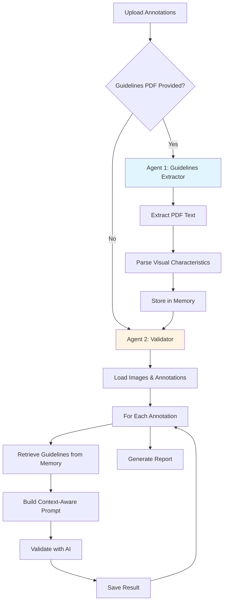

# Agentic Label Checker

An intelligent, multi-agent system that validates image annotations using AI. The system automatically extracts annotation guidelines and uses them to verify if your bounding boxes and polygons are correctly labeled.

## Quick Start

### 1. Install Dependencies

```bash
pip install -r requirements.txt
```

### 2. Prepare Your Data

Create a `data` folder with:
- `data/images/` - Your images (JPEG/PNG)
- `data/annotations.json` - COCO-format annotations

### 3. Get a Gemini API Key

Get your free API key from [Google AI Studio](https://aistudio.google.com/app/apikey)

### 4. Run the Demo

```bash
export GEMINI_API_KEY="your-api-key-here"
python demo/run_demo.py
```

This will:
- Load your images and annotations
- Crop each annotated object
- Ask Gemini to verify the label
- Generate a report with confidence scores

**Results** are saved to `demo/output/demo_results.json`

## Testing Without Your Data

Run the unit tests to verify everything works:

```bash
pytest
```

This tests the cropping and JSON parsing logic without calling the Gemini API (free and fast).

## Advanced Usage

For production use with custom settings:

```bash
export GEMINI_API_KEY="your-api-key"
python -m qc_pipeline.run_validation \
  --images-dir data/images \
  --coco-json data/annotations.json \
  --output results.json \
  --padding 8
```

**Options:**
- `--model-name` - Change AI model (default: `gemini-3-flash-preview`)
- `--disable-polygon-mask` - Use rectangular crops instead of masked polygons
- `--guidelines` - Path to text file with labeling guidelines

## How It Works

The system uses a multi-agent workflow to intelligently validate annotations:



### Agent 1: Guidelines Extractor
- Automatically processes annotation guidelines PDF
- Extracts visual characteristics (shape, color, texture, size)
- Stores category definitions in memory
- Triggers automatically when PDF is uploaded

### Agent 2: Validator
- Loads guidelines from shared memory
- Crops each annotated object
- Builds context-aware prompts with visual characteristics
- Validates labels with AI using extracted guidelines
- Reports confidence scores and mismatches

**Key Features:**
- **Automatic Context**: Guidelines extracted and applied automatically
- **Visual Focus**: Emphasizes shape, color, texture, and appearance
- **Stateful Memory**: Context flows between agents seamlessly
- **Traceable**: Full logging of prompts and AI responses

## Requirements

- Python 3.10+
- Gemini API key
- Images in JPEG/PNG format
- Annotations in COCO JSON format

## 📚 Documentation

### Core Documentation
- **[System Architecture](ARCHITECTURE.md)** - Complete architectural overview with diagrams
- **[QC Pipeline](qc_pipeline/README.md)** - Detailed module documentation and architecture
- **[Labellerr Integration](demo/labellerr-integration/README.md)** - Integration guide with workflows
- [Feasibility Assessment](docs/gemini_qc_feasibility.md)
- [Validation Flow Details](docs/gemini_qc_flow.md)

### Quick Navigation
| Component | Description | Documentation |
|-----------|-------------|---------------|
| 🏗️ **System Overview** | High-level architecture, data flows, design decisions | [ARCHITECTURE.md](ARCHITECTURE.md) |
| 🔧 **QC Pipeline** | Core validation engine, modules, API reference | [qc_pipeline/README.md](qc_pipeline/README.md) |
| 🔌 **Labellerr Integration** | Platform integration, workflows, setup guide | [demo/labellerr-integration/README.md](demo/labellerr-integration/README.md) |
