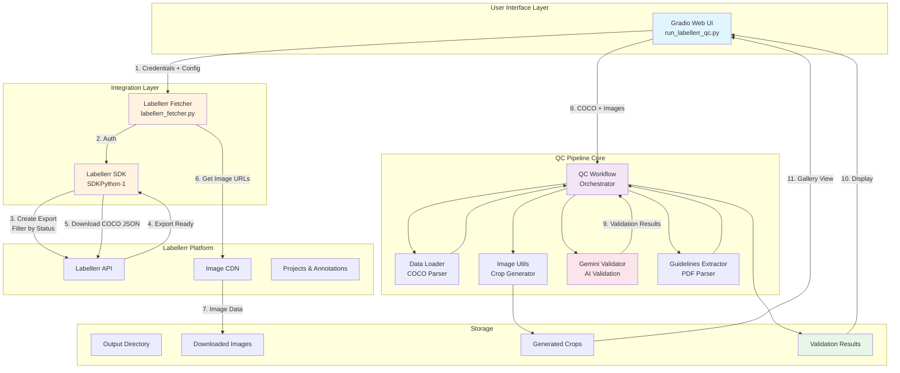
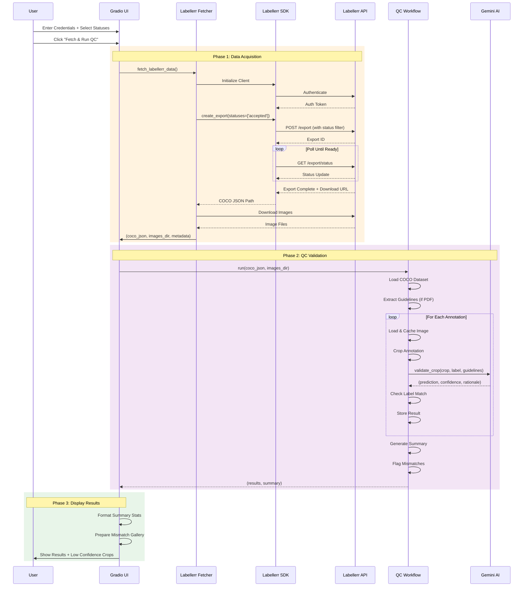

# Labellerr QC Validation Integration

Gradio-based UI for validating Labellerr annotations using Gemini AI. Fetch annotations by status, download images, and run quality checks on your labeled data.

## Overview

This integration connects Labellerr's annotation platform with the Gemini QC validation pipeline. It allows you to:

1. **Fetch annotations** from Labellerr filtered by status (e.g., "accepted", "review")
2. **Download images** referenced by those annotations
3. **Run QC validation** using Gemini AI to verify label accuracy
4. **Review results** with confidence scores and identify problematic annotations

## Workflow

```
Labellerr Project → Export by Status → Download Images → Crop Annotations → Gemini Validation → Results
```

### Key Points

- **Status filtering**: Only annotations with selected statuses are exported
- **Image download**: All images referenced by filtered annotations are downloaded
- **QC validation**: Only the filtered annotations are validated (not all annotations in the images)

## Prerequisites

### 1. Labellerr Credentials

You'll need:
- **API Key**: Your Labellerr API key
- **API Secret**: Your Labellerr API secret
- **Client ID**: Your Labellerr client ID
- **Project ID**: The specific project you want to validate

Get these from your Labellerr account settings.

### 2. Gemini API Key

Get a free Gemini API key from [Google AI Studio](https://aistudio.google.com/app/apikey).

### 3. Dependencies

Install required packages:

```bash
cd /path/to/label-checker
pip install -r requirements.txt
```

This includes:
- `gradio>=4.0.0` - For the UI
- `Pillow>=10.0.0` - For image processing
- `requests>=2.31.0` - For API calls

### 4. Labellerr SDK

Ensure the Labellerr SDK is accessible. The integration expects it at:
```
../../../SDKPython-1/
```

Adjust the path in `labellerr_fetcher.py` if your SDK is located elsewhere.

## Quick Start

### 1. Navigate to Integration Directory

```bash
cd demo/labellerr-integration
```

### 2. Run the Gradio App

```bash
python run_labellerr_qc.py
```

The app will launch at `http://localhost:7860`

### 3. Enter Credentials

In the Gradio UI:
1. Enter your Labellerr credentials (API Key, Secret, Client ID, Project ID)
2. Enter your Gemini API key
3. Select annotation statuses to validate (e.g., "accepted", "client_review")
4. Set max files to process (default: 50)
5. Set low confidence threshold (default: 0.5)

### 4. Run Validation

Click **"Fetch & Run QC"** to start the process. The app will:
1. Create an export from Labellerr with filtered annotations
2. Download the COCO JSON export
3. Download all images referenced in the annotations
4. Crop each annotation from the images
5. Validate each crop with Gemini
6. Display results with confidence scores

## Annotation Statuses

Available status filters:

- **`review`** - Annotations in review
- **`r_assigned`** - Review assigned
- **`client_review`** - Client review status
- **`cr_assigned`** - Client review assigned
- **`accepted`** - Accepted/completed annotations

Select one or more statuses to validate.

## Output

### Directory Structure

```
demo/labellerr-integration/output/
├── images/              # Downloaded project images
│   ├── image_001.jpg
│   ├── image_002.jpg
│   └── ...
├── annotations.json     # Exported COCO annotations (filtered by status)
├── crops/              # Generated annotation crops
│   ├── crop_0_label.png
│   ├── crop_1_label.png
│   └── ...
└── qc_results.json     # Full validation results
```

### Results JSON

The `qc_results.json` contains:

```json
{
  "metadata": {
    "export_id": "...",
    "statuses": ["accepted"],
    "total_images": 25,
    "coco_json": "...",
    "images_dir": "..."
  },
  "results": [
    {
      "image_id": 0,
      "annotation_id": 0,
      "image_file": "image_001.jpg",
      "label": "Horse",
      "crop_path": "crops/crop_0_Horse.png",
      "confidence": 0.95,
      "gemini_response": "{...}",
      "error": null
    }
  ],
  "summary": {
    "total_annotations": 50,
    "total_crops_saved": 50,
    "gemini_validations": 48,
    "average_confidence": 0.87,
    "confidence_by_category": {
      "Horse": 0.92,
      "Dog": 0.83
    },
    "low_confidence_annotations": [...]
  }
}
```

### UI Output

The Gradio interface displays:

1. **Status Messages**: Real-time progress updates
2. **Summary Statistics**: 
   - Total annotations processed
   - Average confidence score
   - Confidence by category
   - Low confidence count
3. **Low Confidence Gallery**: Visual preview of problematic annotations
4. **Full Results JSON**: Complete validation data (expandable)

## Example Usage

### Validate Only Accepted Annotations

1. Select status: `["accepted"]`
2. Set max files: `100`
3. Run validation
4. Review annotations with confidence < 0.5

### QC Client Review Annotations

1. Select statuses: `["client_review", "cr_assigned"]`
2. Set confidence threshold: `0.7` (stricter)
3. Run validation
4. Focus on low confidence results for re-review

## Troubleshooting

### "Failed to import Labellerr SDK"

- Check that the SDK path in `labellerr_fetcher.py` is correct
- Ensure the SDK is installed or accessible at the specified path

### "Export failed" or "No download URL"

- Verify your Labellerr credentials are correct
- Check that the project ID exists and you have access
- Ensure the selected statuses have annotations in the project

### "No images downloaded"

- Check that the COCO export includes image URLs
- Verify network connectivity
- Check Labellerr export format includes `coco_url` or `url` fields

### Gemini API Errors

- Verify your Gemini API key is valid
- Check API quota/rate limits
- Ensure you're using a supported model name

### Low Confidence Scores

- Inspect crops visually in `output/crops/`
- Labels may genuinely not match the image content
- Consider adjusting the Gemini prompt template in `qc_pipeline/gemini_validator.py`

## Advanced Configuration

### Change Gemini Model

Edit `run_labellerr_qc.py`, line ~165:

```python
validator = create_demo_validator(
    api_key=gemini_api_key,
    model_name="gemini-3-flash-preview",  # Change this
    temperature=0.2,
    max_retries=3,
)
```

### Adjust Crop Settings

Edit `run_labellerr_qc.py`, line ~199:

```python
crop_config = CropConfig(
    padding=8,  # Adjust padding
    mask_polygon=True,  # Set to False for rectangular crops
)
```

### Modify SDK Path

Edit `labellerr_fetcher.py`, line ~19:

```python
SDK_PATH = Path(__file__).parent.parent.parent.parent / "SDKPython-1"
```

## Architecture

### System Architecture Overview



### Detailed Data Flow



### Module Integration Map

```mermaid
graph LR
    subgraph "Labellerr Integration"
        LF[labellerr_fetcher.py]
        RUN[run_labellerr_qc.py]
    end
    
    subgraph "QC Pipeline Modules Used"
        DL[data_loader.py]
        IU[image_utils.py]
        GV[gemini_validator.py]
        WF[qc_workflow.py]
        GE[guidelines_extractor.py]
    end
    
    subgraph "External Dependencies"
        SDK[Labellerr SDK]
        GRADIO[Gradio]
        GEMINI[Gemini API]
    end
    
    RUN -->|imports| LF
    RUN -->|imports| DL
    RUN -->|imports| IU
    RUN -->|imports| GV
    RUN -->|imports| WF
    RUN -->|imports| GE
    
    LF -->|uses| SDK
    RUN -->|uses| GRADIO
    GV -->|calls| GEMINI
    GE -->|calls| GEMINI
    
    style LF fill:#fff3e0
    style RUN fill:#e1f5fe
    style WF fill:#f3e5f5
    style GV fill:#fce4ec
```



### Key Integration Points

1. **Labellerr → QC Pipeline**
   - `labellerr_fetcher.py` downloads COCO JSON and images
   - Output format matches QC pipeline's expected input
   - No modifications to QC pipeline code needed

2. **QC Pipeline → Gradio UI**
   - `run_labellerr_qc.py` orchestrates the workflow
   - Wraps QC pipeline in Gradio interface
   - Real-time status updates via Gradio components

3. **Stateful Session Management**
   - Guidelines extracted once per session
   - Stored in Gradio `State` component
   - Reused across multiple validation runs

### Component Responsibilities

| Component | Purpose | Key Functions |
|-----------|---------|---------------|
| `labellerr_fetcher.py` | SDK integration | `create_and_download_export()`<br/>`download_project_images()` |
| `run_labellerr_qc.py` | UI orchestration | `run_qc_validation()`<br/>`process_guidelines_pdf()`<br/>`create_gradio_interface()` |
| `qc_workflow.py` | Validation workflow | `run()`<br/>`_validate_annotations()`<br/>`_generate_summary()` |
| `gemini_validator.py` | AI validation | `validate_crop()`<br/>`_build_request_body()` |

### Data Transformations

```
Labellerr Annotations (API format)
    ↓ [SDK Export]
COCO JSON (standard format)
    ↓ [data_loader.py]
CocoDataset (Python objects)
    ↓ [image_utils.py]
Cropped Images (PNG bytes)
    ↓ [gemini_validator.py]
Validation Results (structured)
    ↓ [qc_workflow.py]
Summary Statistics + Mismatches
    ↓ [run_labellerr_qc.py]
Gradio UI Display
```

## SDK Functions Used

From `labellerr/core/projects/base.py`:

### Create Export

```python
export_config = schemas.CreateExportParams(
    export_name="QC Export",
    export_description="Export for QC validation",
    export_format="json",
    statuses=["accepted", "client_review"],  # Filter by status
    export_destination=schemas.ExportDestination.LOCAL
)
export = project.create_export(export_config)
result = export.status(interval=2.0, timeout=300)
download_url = result["status"][0]["download_url"]
```

## Notes

- **Export by status**: The SDK's `create_export()` filters annotations by the selected statuses
- **All images downloaded**: We download all images that have at least one annotation with the selected status
- **Selective validation**: Only the filtered annotations are validated, not all annotations in the images
- **Asynchronous export**: Export creation is asynchronous; we poll until it's ready

## Future Enhancements

Potential improvements:

- [ ] Batch processing for large projects
- [ ] Export to CSV/Excel for easier review
- [ ] Integration with other VLMs (CLIP, LLaVA)
- [ ] Automated re-labeling suggestions
- [ ] Historical validation tracking
- [ ] Multi-project support

## Support

For issues or questions:

1. Check the troubleshooting section above
2. Review the main QC pipeline documentation
3. Verify Labellerr SDK documentation
4. Check Gemini API documentation

## License

Same as the parent QC pipeline project.

