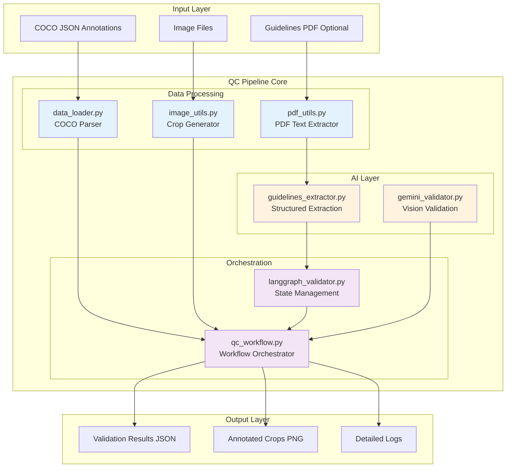
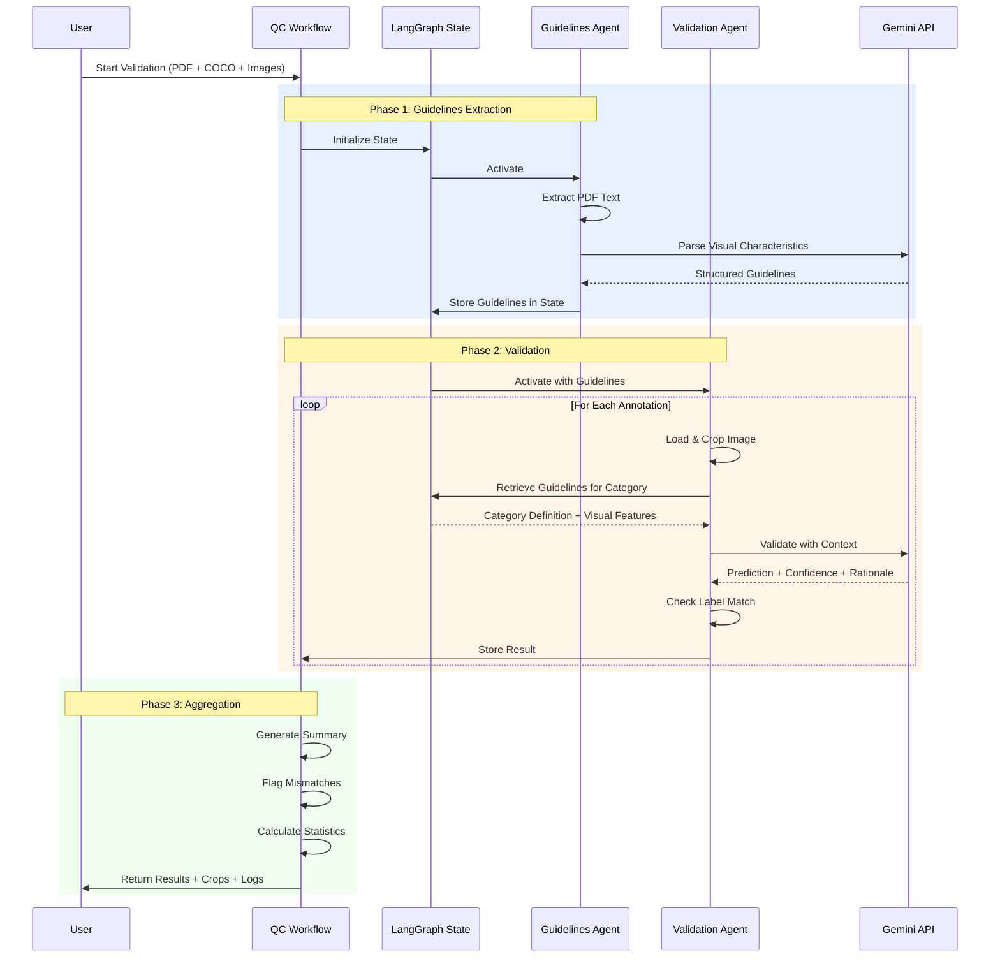
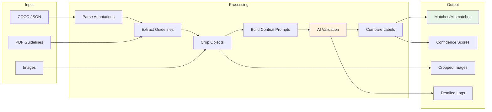

# QC Pipeline - AI-Powered Annotation Validation

A modular, production-ready pipeline for validating image annotations using Google's Gemini AI. The pipeline automatically extracts guidelines from PDFs and validates whether annotations match their expected labels with detailed confidence scoring and mismatch detection.

---

## 📋 Table of Contents

- [Architecture Overview](#architecture-overview)
- [Core Components](#core-components)
- [Workflow Architecture](#workflow-architecture)
- [Data Flow](#data-flow)
- [Module Details](#module-details)
- [Usage Examples](#usage-examples)

---

## 🏗️ Architecture Overview

The QC Pipeline follows a **modular, agent-based architecture** with clear separation of concerns:



---

## 🔧 Core Components

### 1. **Data Processing Layer**

#### `data_loader.py` - COCO Dataset Parser
- **Purpose**: Load and parse COCO-format annotations
- **Key Classes**:
  - `Category`: Label definitions (id, name, supercategory)
  - `ImageInfo`: Image metadata (dimensions, paths)
  - `Annotation`: Annotation data (bbox, segmentation, area)
  - `CocoDataset`: Main container with iteration support
- **Features**:
  - Validates data integrity (checks for missing images/categories)
  - Supports both bounding boxes and polygon segmentations
  - Memory-efficient iteration with `iter_annotations()`

#### `image_utils.py` - Crop Generator
- **Purpose**: Extract annotated regions from images
- **Key Functions**:
  - `crop_annotation()`: Smart cropping with padding
  - `image_to_png_bytes()`: Format conversion for API
- **Features**:
  - Configurable padding around crops
  - Polygon masking (isolates exact object shape)
  - Transparent backgrounds for masked regions
  - Handles both bbox and polygon formats

#### `pdf_utils.py` - PDF Text Extractor
- **Purpose**: Extract text from guideline PDFs
- **Features**:
  - Page-by-page extraction
  - Error handling for corrupted PDFs
  - Text concatenation and cleanup

---

### 2. **AI Validation Layer**

#### `gemini_validator.py` - Vision Validation Engine
- **Purpose**: Core AI validation using Gemini
- **Prompt Templates**:
  - `DEMO_PROMPT_TEMPLATE`: Simple classification
  - `DEFAULT_PROMPT_TEMPLATE`: Structured validation
  - `GUIDELINES_PROMPT_TEMPLATE`: Context-aware validation with step-by-step protocol
- **Key Features**:
  - Structured JSON responses (prediction_label, confidence, rationale)
  - Automatic retry with exponential backoff
  - Code execution support for counting/analysis
  - Label mismatch detection
  - Guidelines integration for enhanced accuracy

#### `guidelines_extractor.py` - Structured Guideline Parser
- **Purpose**: Extract visual characteristics from PDF text
- **Uses**: LangChain + Pydantic for structured extraction
- **Extracts**:
  - Label definitions
  - Key visual characteristics (shape, color, texture, size)
  - Examples and common mistakes
  - Edge cases and confusion points
- **Output**: Structured `LabelDefinition` objects

---

### 3. **Orchestration Layer**

#### `langgraph_validator.py` - State Management
- **Purpose**: LangGraph-based stateful workflow
- **State Schema** (`QCValidationState`):
  - PDF processing state
  - Extracted guidelines dictionary
  - Categories found
  - Status messages
  - Error tracking
- **Agents**:
  - **Guidelines Agent**: Extracts and structures PDF guidelines
  - **Validation Agent**: Validates crops using guidelines

#### `qc_workflow.py` - Main Workflow Orchestrator
- **Purpose**: High-level workflow coordination
- **Responsibilities**:
  - Dataset loading
  - Guidelines extraction (if PDF provided)
  - Batch validation with caching
  - Result aggregation and summary generation
  - Mismatch detection and flagging
- **Key Features**:
  - Image caching for performance
  - Match/mismatch tracking
  - Low confidence detection
  - Comprehensive logging
  - JSON result export

---

## 🔄 Workflow Architecture

### Two-Agent Workflow with Stateful Memory



---

## 📊 Data Flow

### Input → Processing → Output



---

## 📦 Module Details

### `data_loader.py`

**Exports:**
```python
from qc_pipeline.data_loader import (
    CocoDataset,      # Main dataset container
    load_coco_dataset, # Factory function
    Category,         # Label definition
    ImageInfo,        # Image metadata
    Annotation        # Annotation data
)
```

**Example:**
```python
dataset = load_coco_dataset("annotations.json")
for image_info, annotation, category in dataset.iter_annotations():
    print(f"Image: {image_info.file_name}, Label: {category.name}")
```

---

### `image_utils.py`

**Exports:**
```python
from qc_pipeline.image_utils import (
    crop_annotation,      # Crop with padding & masking
    CropConfig,          # Configuration object
    image_to_png_bytes   # Convert to bytes
)
```

**Example:**
```python
config = CropConfig(padding=8, mask_polygon=True)
crop = crop_annotation(image, annotation, config)
crop_bytes = image_to_png_bytes(crop)
```

---

### `gemini_validator.py`

**Exports:**
```python
from qc_pipeline.gemini_validator import (
    GeminiValidator,      # Main validator class
    GeminiResponse,       # Response structure
    create_demo_validator # Factory for demo use
)
```

**Example:**
```python
validator = create_demo_validator(api_key="...", model_name="gemini-3.0-flash-exp")
response = validator.validate_crop(
    crop_bytes=crop_bytes,
    expected_label="cat",
    label_definitions={"cat": {...}}
)
print(f"Prediction: {response.prediction_label}, Confidence: {response.confidence}")
```

---

### `qc_workflow.py`

**Main Interface:**
```python
from qc_pipeline.qc_workflow import QCValidationWorkflow

workflow = QCValidationWorkflow(
    gemini_api_key="your-key",
    output_dir=Path("output")
)

state, results, summary = workflow.run(
    pdf_path="guidelines.pdf",  # Optional
    coco_json_path="annotations.json",
    images_dir=Path("images"),
    max_files=100,
    confidence_threshold=0.5
)

print(f"Matches: {summary.matches}, Mismatches: {summary.mismatches}")
```

---

## 🎯 Key Features

### 1. **Intelligent Mismatch Detection**
- Compares Gemini's prediction with expected label
- Flags mismatches regardless of confidence
- Separate tracking for low confidence vs. wrong labels

### 2. **Context-Aware Validation**
- Automatically extracts visual guidelines from PDFs
- Builds detailed prompts with category characteristics
- Step-by-step validation protocol

### 3. **Robust Error Handling**
- Automatic retries with exponential backoff
- Graceful degradation (continues on errors)
- Comprehensive error logging

### 4. **Performance Optimization**
- Image caching to avoid repeated loads
- Batch processing with progress tracking
- Efficient memory management

### 5. **Comprehensive Reporting**
```json
{
  "results": [
    {
      "annotation_id": 123,
      "label": "cat",
      "prediction_label": "dog",
      "is_match": false,
      "confidence": 0.95,
      "rationale": "Clear canine features..."
    }
  ],
  "summary": {
    "total_annotations": 100,
    "matches": 85,
    "mismatches": 15,
    "average_confidence": 0.87,
    "mismatched_annotations": [...]
  }
}
```

---

## 🚀 Usage Examples

### Basic Validation (No Guidelines)
```python
from pathlib import Path
from qc_pipeline.qc_workflow import QCValidationWorkflow

workflow = QCValidationWorkflow(
    gemini_api_key="your-gemini-key",
    output_dir=Path("output")
)

state, results, summary = workflow.run(
    pdf_path=None,
    coco_json_path=Path("annotations.json"),
    images_dir=Path("images"),
    max_files=50,
    confidence_threshold=0.5
)

print(f"Accuracy: {summary.matches / summary.gemini_validations * 100:.1f}%")
```

### Advanced Validation (With Guidelines)
```python
# Extract guidelines first, then validate
workflow = QCValidationWorkflow(
    gemini_api_key="your-gemini-key",
    output_dir=Path("output")
)

state, results, summary = workflow.run(
    pdf_path="annotation_guidelines.pdf",
    coco_json_path=Path("annotations.json"),
    images_dir=Path("images"),
    max_files=100,
    confidence_threshold=0.6
)

# Check mismatches
for mismatch in summary.mismatched_annotations:
    print(f"❌ Expected '{mismatch['label']}', got '{mismatch['prediction_label']}'")
```

### CLI Usage
```bash
export GEMINI_API_KEY="your-key"

python -m qc_pipeline.run_validation \
  --images-dir data/images \
  --coco-json data/annotations.json \
  --output results.json \
  --guidelines guidelines.txt \
  --padding 8 \
  --model-name gemini-3.0-flash-exp
```

---

## 📈 Performance Metrics

The pipeline tracks:
- **Total annotations processed**
- **Crops saved successfully**
- **Matches vs. mismatches**
- **Accuracy percentage**
- **Average confidence score**
- **Confidence by category**
- **Low confidence count**

---

## 🔍 Logging

The pipeline provides detailed logging at multiple levels:

1. **Guidelines Extraction Log** (`guidelines_extraction.log`)
   - PDF text extraction status
   - Gemini extraction prompts and responses
   - Categories found and definitions

2. **Validation Prompts Log** (`validation_prompts.log`)
   - First 3 validation prompts (for debugging)
   - All prompts using guidelines
   - Gemini responses with rationale

3. **Console Output**
   - Real-time progress updates
   - Match/mismatch indicators
   - Error messages

---

## 🛠️ Configuration

### Crop Configuration
```python
CropConfig(
    padding=8,                           # Pixels around bbox
    mask_polygon=True,                   # Use polygon masking
    background_color=(0, 0, 0, 0)       # Transparent RGBA
)
```

### Validator Configuration
```python
GeminiValidator(
    api_key="...",
    model_name="gemini-3.0-flash-exp",
    temperature=0.1,                     # Lower = more deterministic
    max_retries=3,
    timeout_seconds=30,
    enable_code_execution=True           # For counting features
)
```

---

## 📚 Dependencies

- `pillow` - Image processing
- `pypdf` - PDF text extraction
- `google-generativeai` - Gemini API
- `langchain-google-genai` - Structured extraction
- `langgraph` - State management
- `pydantic` - Data validation

---

## 🐛 Troubleshooting

### Common Issues

**Issue**: Low accuracy on similar categories (e.g., cat vs. dog)
- **Solution**: Provide detailed guidelines PDF with visual characteristics

**Issue**: "Image not found" errors
- **Solution**: Ensure `images_dir` matches the path structure in COCO JSON

**Issue**: Gemini API rate limits
- **Solution**: Add delays or use batch processing with smaller `max_files`

**Issue**: Out of memory with large datasets
- **Solution**: Process in batches, images are cached per batch

---

## 📄 License

MIT License - see main repository for details.
